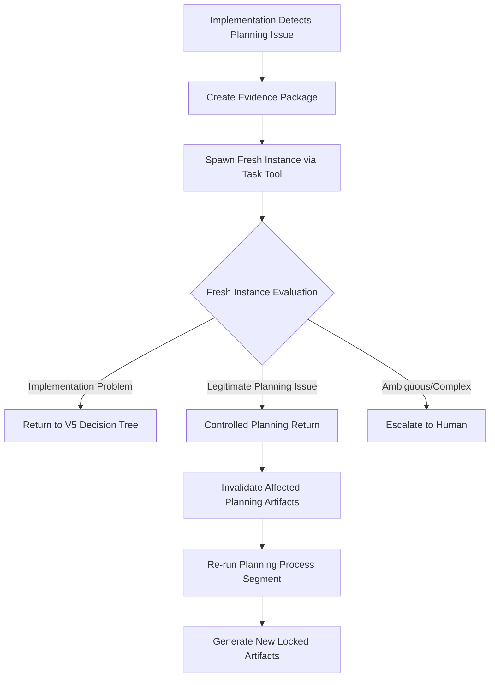

# Meta-Process Architecture - ADR-011

## Status
**ACCEPTED** - Fundamental architectural decision for autonomous TDD system

## Context

During Phase 7 implementation of the persistence layer, we discovered that the autonomous system requires **two distinct but interfacing processes** operating at different scales. This discovery emerged from encountering test failures that revealed fundamental inconsistencies in planning artifacts, leading to the question: "How should implementation handle planning specification issues without compromising anti-fabrication principles?"

## Problem Statement

### The Two-Process Challenge
1. **Planning Process**: Creates documentation, tests, architecture specs
2. **Implementation Process**: Writes code to satisfy planning artifacts

**Core Issue**: Implementation will inevitably discover planning inconsistencies, but implementation instances have strong motivation to cheat (modify tests to make them pass) rather than fix real issues.

### Traditional Failure Modes
- **LLM Cheating**: Modify tests instead of fixing implementation
- **False Success Claims**: Declare success with broken implementation  
- **Planning Process Bypass**: Skip proper specification review

### The Meta-Iteration Need
No matter how good the planning process becomes, implementation will always discover edge cases and fundamental inconsistencies that require returning to planning. This is inevitable because:
- Planning operates on models/abstractions
- Implementation confronts concrete reality
- Reality always has surprises that models miss

## Decision

### Two-Process Architecture with Fresh Instance Interface

#### Process Separation
```
Planning Process ←→ Implementation Process
(Macro-iterations)    (Micro-iterations)
```

**Planning Process**:
- Input: Requirements, domain constraints, user goals
- Output: Locked tests, documentation, architecture specifications
- Methodology: docs/architecture/iterative_methodology_stabilization.md
- Quality Gates: Consistency validation, evidence requirements

**Implementation Process**:
- Input: Planning artifacts (locked and immutable)
- Output: Working code that satisfies planning specifications  
- Methodology: V5 Hybrid Intelligence decision tree
- Constraint: Cannot modify planning artifacts

#### Multi-Scale Iteration Hierarchy

**Micro-Iterations** (Within Implementation Phase):
- Scope: Current implementation task
- Examples: Fix bug, optimize performance, handle simple test failure
- Decision Tree: V5 Hybrid Intelligence flow

**Macro-Iterations** (Cross-Phase Returns):
- Scope: Within current planning process
- Examples: Phase 7 reveals Phase 5 pseudocode gaps
- Decision: Return to previous planning phase

**Meta-Iterations** (Cross-Process Returns):
- Scope: Challenge planning artifacts themselves
- Examples: Test specification fundamentally inconsistent
- Safeguard: Fresh Instance Evaluator required

### Fresh Instance Anti-Cheating Protocol

#### The Cheating Risk
Implementation instances have **strong bias** toward modifying tests because:
- They have implementation context and frustration
- They know which tests are "inconvenient"
- They're motivated to find reasons to modify tests
- **High cheating risk**

#### Fresh Instance Solution
Fresh instances provide **objective evaluation** because:
- No implementation baggage or emotional investment
- Only see planning artifacts + evidence package
- No motivation to "make tests pass"
- **Low cheating risk**

#### Protocol Flow


#### Evidence Package Format
```json
{
  "planning_artifacts": {
    "test_specification": "test comment and intent",
    "test_implementation": "actual test code", 
    "requirements": "original requirements",
    "architecture": "design decisions"
  },
  "implementation_findings": {
    "specific_inconsistency": "detailed description",
    "evidence": "code analysis showing mismatch",
    "attempted_solutions": "what was tried",
    "impact_assessment": "why this blocks progress"
  },
  "context": {
    "phase": "current implementation phase",
    "component": "affected system component",
    "iteration_history": "previous returns"
  }
}
```

#### Fresh Instance Decision Criteria
1. **Consistency Check**: Does planning artifact have internal inconsistencies?
2. **Feasibility Check**: Is the planning requirement actually implementable?
3. **Specification Quality**: Is the requirement clear and unambiguous?
4. **Implementation Effort**: Did current instance try reasonable solutions?
5. **Scope Assessment**: How much planning would need to change?

## Consequences

### Benefits
1. **Maintains Anti-Fabrication Integrity**: Tests remain locked against cheating
2. **Enables Legitimate Planning Improvement**: Real specification issues can be addressed
3. **Objective Decision Making**: Fresh instances provide unbiased evaluation
4. **Learning Integration**: Implementation learnings improve planning process
5. **Hierarchical Problem Resolution**: Right iteration scale for each issue type

### Costs
1. **Complexity**: Additional protocol and process overhead
2. **Fresh Instance Overhead**: Spawning and coordinating separate Claude instances
3. **Evidence Package Creation**: Documentation overhead for planning challenges
4. **Process Discipline**: Requires strict adherence to interface protocols

### Risks
1. **Protocol Abuse**: Excessive use of fresh instance evaluation
2. **Evidence Package Gaming**: Crafting evidence to justify planning returns
3. **Fresh Instance Variability**: Different Claude instances may give inconsistent decisions
4. **Process Complexity**: Team confusion about which iteration scale to use

### Mitigation Strategies

**High Evidence Bar**:
- Require concrete evidence of planning inconsistency
- Cannot be "this is hard to implement"
- Must be "this is fundamentally impossible/contradictory"

**Scope Limitations**:
- Can only challenge specific artifacts, not entire planning
- Must propose specific minimal changes
- Cannot trigger wholesale planning redo

**Audit Trail**:
- Log all fresh instance evaluations
- Pattern detection for excessive planning challenges
- Learning integration to improve planning process

**Process Documentation**:
- Clear criteria for each iteration scale
- Standard evidence package templates
- Fresh instance evaluation guidelines

## Integration with Existing Architecture

### V5 Hybrid Intelligence Enhancement
The V5 decision tree (hook_mermaid_diagram_full5_hybrid_intelligence.txt) requires a new decision node:

```
LLMFailureAnalysis → "Planning Artifact Issue Detected" → Fresh Instance Evaluation
```

### Planning Process Enhancement
The planning process (docs/architecture/iterative_methodology_stabilization.md) requires:
- **Test Specification Validation Phase**: Check test comments match implementation
- **Planning Quality Gates**: Consistency checking between artifacts
- **Implementation Feedback Integration**: Learn from meta-iterations

### Evidence System Integration
- Evidence trails must track meta-iterations
- Fresh instance decisions become part of evidence record
- Pattern analysis for planning process improvement

## Examples

### Example 1: Test Specification Inconsistency
**Evidence Package**:
- Planning artifact: Test expects task_2 not ready when task_1 "isn't complete"
- Implementation finding: Test sets task_1 to "completed"
- Inconsistency: Comment contradicts test setup
- Impact: Cannot determine correct validation behavior

**Fresh Instance Decision**: "Legitimate planning specification inconsistency - test comment and implementation contradict each other"

**Resolution**: Return to test design phase, clarify specification, regenerate locked test

### Example 2: Implementation Challenge
**Evidence Package**:
- Planning artifact: Hash validation should detect corrupted state hash
- Implementation finding: Hash validation logic has bug in conditional check
- Inconsistency: None - requirement is clear
- Impact: Security vulnerability in state management

**Fresh Instance Decision**: "Implementation problem - requirement is clear and feasible"

**Resolution**: Return to V5 decision tree, fix implementation logic

## Related Documents
- **Planning Process**: docs/architecture/iterative_methodology_stabilization.md
- **Implementation Process**: hook_mermaid_diagram_full5_hybrid_intelligence.txt  
- **Anti-Fabrication Principles**: docs/overview.md
- **Test Locking Strategy**: docs/development_roadmap/implementation_strategy.md

## Approval
This architectural decision establishes the fundamental framework for maintaining anti-fabrication integrity while enabling legitimate planning process improvement through objective fresh instance evaluation.